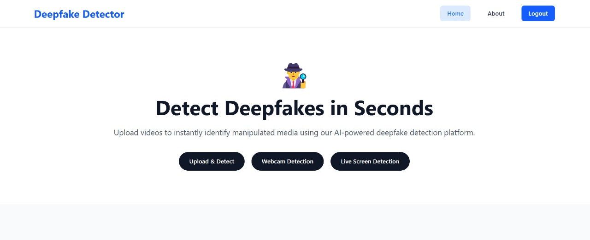

# Real-Time Deepfake Detection System

## 🚀 Overview

This project is a real-time deepfake detection system designed to help users identify manipulated video content—such as deepfakes—during live video calls, screen captures, or webcam feeds. It also supports detection of pre-recorded deepfake videos. The goal is to promote safer online experiences and combat the growing threats of misinformation, impersonation, and digital content abuse.

---

## 🎯 Problem Statement

As internet penetration and social media usage continue to rise, users—especially the youth are increasingly exposed to misleading content. Deepfakes are being used to:

- Spread **hate speech**, **misinformation**, and **political propaganda**
- **Defame individuals** using AI-generated adult content
- **Spoof identities** in real-time video calls for scams

Our system detects and flags such content in **real time**, making the internet a safer and more trustworthy space.

---

## 💡 Unique Approach

- ✅ **Real-time detection:** Unlike most tools that work post-upload, our system works live on webcam or screen capture.
- 🔍 **Screen region selection:** Users can draw a bounding box on the screen to detect fake content in that region.
- 🌐 **REST API enabled:** All features can be triggered via HTTP routes, making it scalable for different platforms.

---

## 🔮 Future Scope

- 🧩 **Chrome Extension:** Browser-based plugin for instant detection on any video content.
- 🤝 **Social Media Integration:** Partner with platforms like Instagram and X (formerly Twitter) to natively integrate our detection engine.

---

## 🛠 Tech Stack

| Component        | Tech Used   |
| ---------------- | ----------- |
| Frontend         | React.js    |
| Backend          | FastAPI     |
| Video Processing | OpenCV, MSS |
| Model Inference  | PyTorch     |
| Communication    | REST APIs   |

---

## 🧪 How to Use

### Backend Setup

```bash
git clone https://github.com/sharmaanshul007/HackByte_IIIT_Jabalpur.git
cd HackByte_IIIT_Jabalpur/backend

# Create virtual environment
python -m venv venv
# Activate (Windows)
venv\Scripts\activate
# Or Activate (Unix/Mac)
source venv/bin/activate

# Install dependencies
pip install -r requirements.txt

# Run server
uvicorn main:app --reload
```

### Frontend Setup

```bash
cd ../frontend
npm install
npm run dev
```

### Routes (FastAPI)

## 🛣️ API Routes

| Method | Route             | Description                         |
| ------ | ----------------- | ----------------------------------- |
| GET    | `/`               | Home route                          |
| POST   | `/signup`         | User registration                   |
| POST   | `/login`          | User login                          |
| POST   | `/check`          | Upload and check a downloaded video |
| GET    | `/capture/cam`    | Capture from webcam for detection   |
| GET    | `/capture/screen` | Capture screen region for detection |

## Use Case

[](assets/use-case.mp4)

## Demo

[](https://youtu.be/2_aaJNtOhq0)
